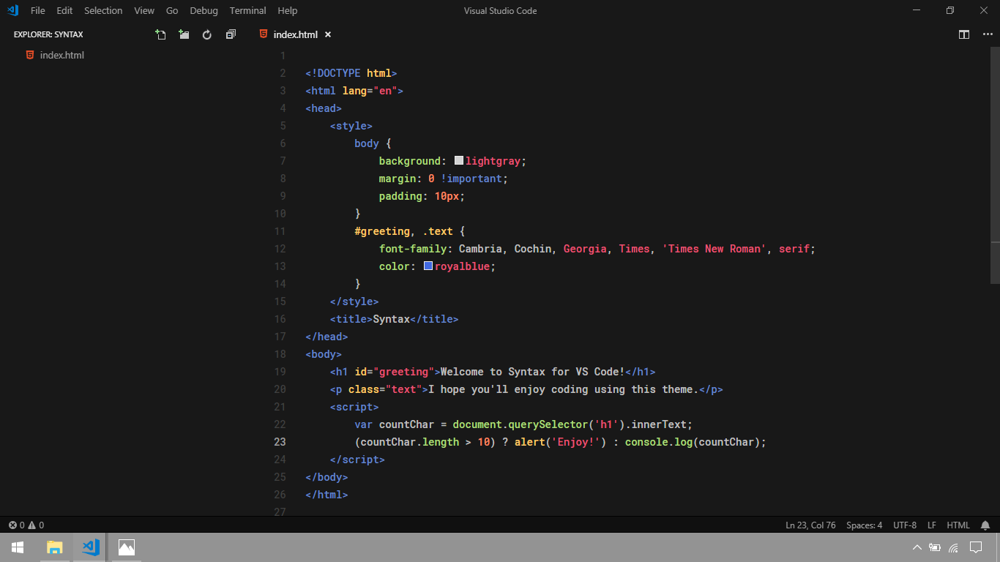
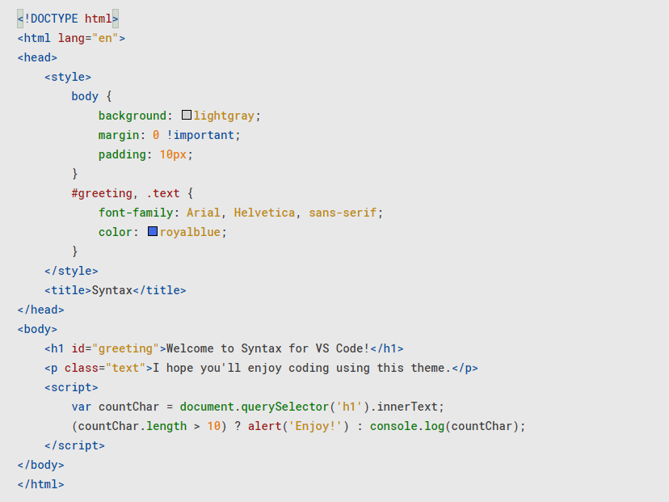

# Syntax Theme
A simple light and dark theme for VS Code.

### Previews
#### DARK


#### LIGHT


### Addons to install and setup to match the previews

##### Icon Theme
- [Material Icon Theme](https://marketplace.visualstudio.com/items?itemName=PKief.material-icon-theme) -- customized folder icon color: #6688CC
##### Editor Font
- [Roboto Mono](https://fonts.google.com/specimen/Roboto+Mono) -- change editor font family in VS Code settings
##### Editor User Settings
```json
{
    "editor.fontFamily": "Roboto Mono Medium",
    "editor.fontSize": 14,
    "editor.lineHeight": 24,
    "editor.minimap.enabled": false,
    "editor.overviewRulerBorder": false,
    "editor.renderIndentGuides": false,
    "editor.renderLineHighlight": "none",
    "editor.roundedSelection": false,
    "workbench.editor.tabSizing": "fit",
    "window.title": "${appName}",
    "explorer.openEditors.visible": 0,
    "terminal.integrated.fontSize": 14,
    "window.titleBarStyle": "custom",
    "workbench.colorTheme": "Syntax Theme",
    "workbench.iconTheme": "material-icon-theme",
    "material-icon-theme.folders.color": "#6688cc"
}
```

**Enjoy!**
